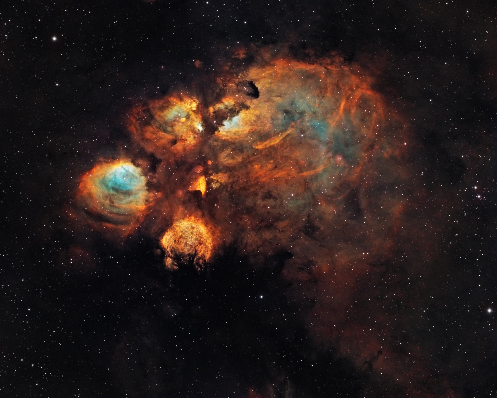

[mu-sh.studio]: <https://mu-sh.studio>

[GitHub Pages]: <https://pages.github.com/>

[Creating a GitHub Pages site]: <https://docs.github.com/en/pages/getting-started-with-github-pages/creating-a-github-pages-site>

[Find all DNS records of a given domain name]: <https://mxtoolbox.com/SuperTool.aspx>

[Verifying your custom domain for GitHub Pages site]: <https://docs.github.com/en/pages/configuring-a-custom-domain-for-your-github-pages-site/verifying-your-custom-domain-for-github-pages>

[Managing a custom domain for your GitHub Pages site]: <https://docs.github.com/en/pages/configuring-a-custom-domain-for-your-github-pages-site/managing-a-custom-domain-for-your-github-pages-site>

[Getting started with Search Console]: <https://support.google.com/webmasters/answer/10267942>

[Google Search Console Dashboard]: <https://search.google.com/search-console>

[Home]: <https://mu-sh.studio>

[About]: <https://mu-sh.studio/about>

[README]: <https://github.com/MforMubashshera/mformubashshera.github.io/blob/main/README.md> "README.md"

[INDEX]: <https://github.com/MforMubashshera/mformubashshera.github.io/blob/main/index.html> "index.html"

[STYLE]: <https://github.com/MforMubashshera/mformubashshera.github.io/blob/main/style.css> "style.css"

[ICON]: <https://github.com/MforMubashshera/mformubashshera.github.io/blob/main/m_icon.png> "m_icon.png"

[COVER IMAGE]: <https://github.com/MforMubashshera/mformubashshera.github.io/blob/main/esa-hubble_cats-paw-nebula.webp> "esa-hubble_cats-paw-nebula.webp"

> Table of contents
* [Mubashshera's portfolio at [mu-sh.studio](https://mu-sh.studio)](#mubashsheras-portfolio-at-mu-shstudio)
	* [About The Project](#about-the-project)
	* [Pages](#pages)
	* [Repo assets](#repo-assets)

***

# Mubashshera's portfolio at [mu-sh.studio]

## About The Project

The portfolio page includes my resume — also showcases my collaborative and solo projects.

## Pages

* [Home] — landing page
* [About] — about me

## Repo assets

* [README] — top level README of this repo
* [INDEX] — landing page
* [STYLE] — stylesheet
* [ICON] — shortcut favicon
* [COVER IMAGE] — page cover image

***

*Hosted on [GitHub Pages]. Learn more:*

* [Creating a GitHub Pages site]

* [Find all DNS records of a given domain name]

* [Verifying your custom domain for GitHub Pages site]

* [Managing a custom domain for your GitHub Pages site]

* [Getting started with Search Console]

* [Google Search Console Dashboard]

***